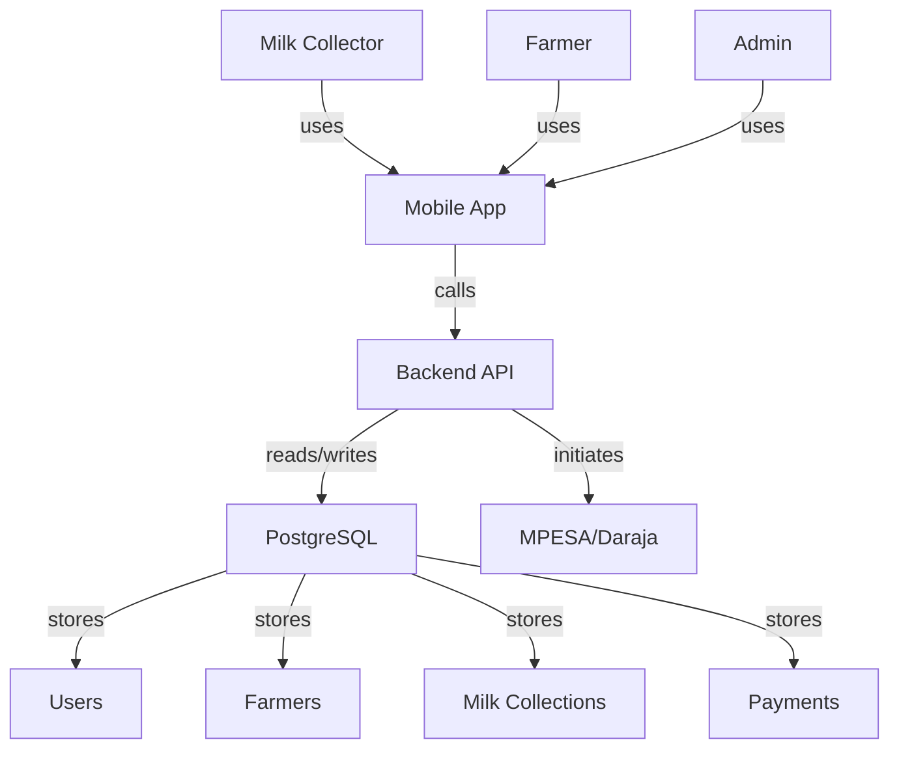
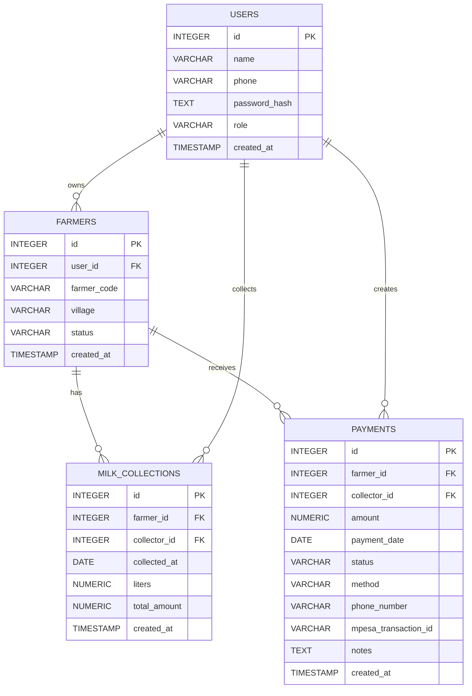
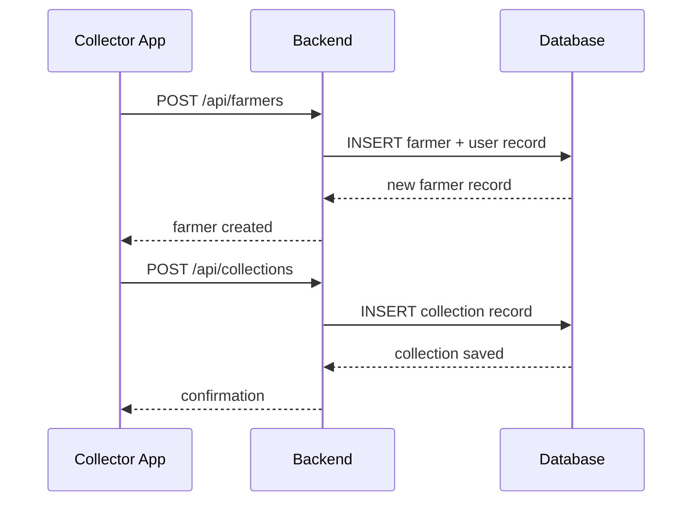
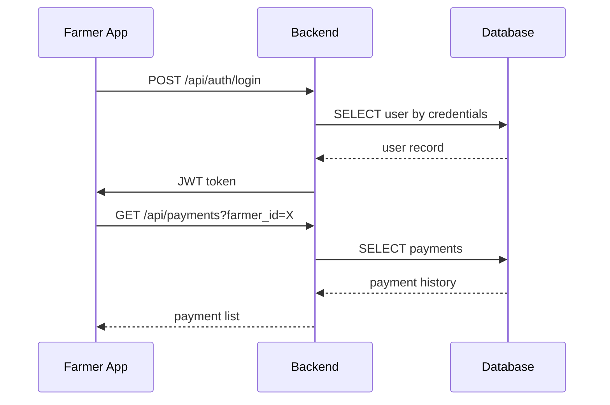
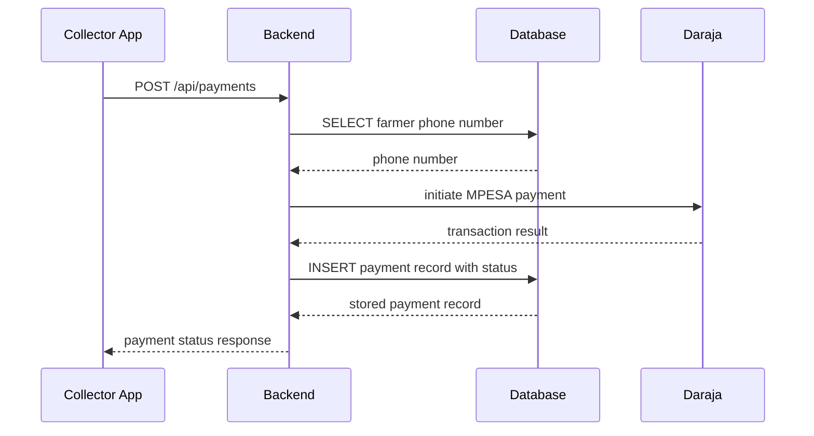
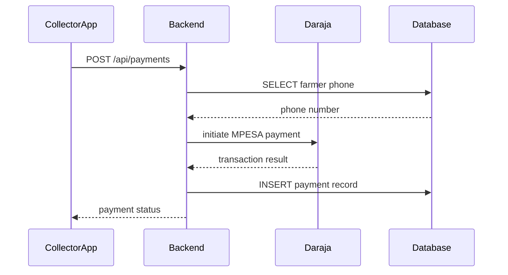

# System Design

## Project Overview

The Mobile-Based Milk Collection and Management System is a mobile-first solution designed to improve milk collection, payment management, and reporting for rural dairy operations. It provides a single Expo React Native application with role-based screens for Milk Collectors, Farmers, and Admins, supported by a Node.js + Express backend and PostgreSQL database.

This design document covers:
- Architecture
- Roles and responsibilities
- System modules
- Data model
- API design
- Mobile app flow
- Offline strategy
- MPESA payment integration
- Security
- Deployment

---

## Architecture

The system is composed of three primary layers:

1. **Mobile App**
   - Expo React Native application
   - Single app with role-based navigation
   - Local storage for offline collection activity
2. **Backend API**
   - Node.js + Express
   - JWT authentication and authorization
   - Business logic for farmers, collections, payments, and reports
3. **Database**
   - PostgreSQL
   - Centralized relational model for users, farmers, collections, and payments

### Architecture Diagram

```mermaid
flowchart LR
  MobileApp[Mobile App (React Native)] -->|HTTPS| Backend[Backend API (Node.js + Express)]
  Backend -->|SQL| Database[PostgreSQL Database]
  MobileApp -->|Local Storage| Device[Device Cache / Offline Storage]
  Backend -->|MPESA API| Daraja[MPESA/Daraja Service]
  subgraph Mobile
    MobileApp
    Device
  end
  subgraph Server
    Backend
    Database
    Daraja
  end
```

---

## Use Case Diagram

```mermaid
usecaseDiagram
  actor Collector
  actor Farmer
  actor Admin

  Collector --> (Register Farmer)
  Collector --> (Record Milk Collection)
  Collector --> (Initiate Payment)
  Collector --> (View Collection History)

  Farmer --> (View Delivery History)
  Farmer --> (View Payment History)
  Farmer --> (View Balance)

  Admin --> (View Reports)
  Admin --> (Manage Users)
  Admin --> (Monitor System Activity)
```

---

## Conceptual Diagram



---

## User Roles

### Milk Collector
- Creates farmer accounts
- Records milk collections
- Records payments
- Views collection and payment summaries
- Searches and manages farmers

### Farmer
- Logs in only after being registered by a collector
- Views own milk delivery history
- Views own payment history and outstanding balance
- Receives transparency on payments

### Admin
- Monitors users and system activity
- Views reporting analytics
- Manages accounts and status

---

## Core Modules

### Authentication Module
- Phone/password login for all roles
- JWT-based token authentication
- Role-based access control
- Password hashing with `bcrypt`

### Farmer Module
- Collector-driven farmer registration
- Farmer profile fields: name, phone, village, farmer code
- Farmer status tracking

### Milk Collection Module
- Collector records daily milk delivery per farmer
- Data captured: date, liters, total amount
- Collection history per farmer

### Payment Module
- Collector creates payment records
- MPESA disbursements use the farmer's registered phone number
- Payment status tracking: `pending`, `paid`, `failed`
- Payment history per farmer
- Payment methods include `mpesa`, `cash`, etc.

### Reporting Module
- Online-only reports
- Daily, weekly, monthly summaries
- Farmer-level and collector-level insights
- Balance reports and outstanding payments

### Offline Support
- Offline storage for:
  - Milk collection entries
  - Cached farmer data
  - Read-only historical views
- No offline payment queue
- Payments require online connectivity
- Reports require online connectivity

---

## Data Model

### Entity Relationship Diagram



### Tables and Fields

#### `users`
- `id`: primary key
- `name`
- `phone`
- `password_hash`
- `role`: `collector`, `farmer`, or `admin`
- `created_at`

#### `farmers`
- `id`
- `user_id`: references `users.id`
- `farmer_code`: unique collector-assigned code
- `village`
- `status`
- `created_at`

#### `milk_collections`
- `id`
- `farmer_id`: references `farmers.id`
- `collector_id`: references `users.id`
- `collected_at`
- `liters`
- `total_amount`
- `created_at`

#### `payments`
- `id`
- `farmer_id`: references `farmers.id`
- `collector_id`: references `users.id`
- `amount`
- `payment_date`
- `status`
- `method`
- `phone_number`
- `mpesa_transaction_id`
- `notes`
- `created_at`

---

## API Design

### Authentication Endpoints
- `POST /api/auth/login`
- `GET /api/auth/me`

### Farmer Endpoints
- `POST /api/farmers` — only collector or admin
- `GET /api/farmers` — collector/admin
- `GET /api/farmers/:id` — collector/admin or farmer on own record
- `PUT /api/farmers/:id` — collector/admin
- `DELETE /api/farmers/:id` — collector/admin

### Milk Collection Endpoints
- `POST /api/collections` — collector only
- `GET /api/collections` — filter by role and ownership
- `GET /api/collections/:id`

### Payment Endpoints
- `POST /api/payments` — collector only
- `GET /api/payments` — farmer sees own history, collector/admin sees records
- `GET /api/payments/:id`

### Reporting Endpoints
- `GET /api/reports/daily`
- `GET /api/reports/monthly`
- `GET /api/reports/balances`

---

## Mobile App Flow

### Navigation Structure
- `AuthStack`
  - Login
- `CollectorStack`
  - Dashboard
  - Create Farmer
  - Farmer List
  - Record Collection
  - Record Payment
  - Collection History
  - Payment History
  - Reports
- `FarmerStack`
  - Dashboard
  - My Deliveries
  - My Payments
  - Balance Summary
- `AdminStack`
  - Dashboard
  - User Management
  - Reports

### Screen Summary

#### Collector Screens
- `Login`
- `Dashboard`
- `Create Farmer`
- `Farmer List`
- `Record Milk Collection`
- `Record Payment`
- `Collection History`
- `Payment History`
- `Reports`

#### Farmer Screens
- `Login`
- `Dashboard`
- `My Deliveries`
- `My Payments`
- `Balance Summary`

#### Admin Screens
- `Login`
- `Dashboard`
- `User Management`
- `Reports`

### Sequence: Collector creates farmer and records collection



### Sequence: Farmer login and view data



### Sequence: Collector initiates MPESA payment



---

## Offline Strategy

### Offline Capabilities
- Local storage for collector milk collection entry
- Cached farmer list for quick lookup
- Read-only access to previously synced history

### Online-Only Capabilities
- Payment creation and MPESA payment initiation
- Report generation
- Farmer login validation
- Payment status updates

### Offline Flow

```mermaid
flowchart TD
  A[Collector enters collection while offline] --> B[Store collection locally]
  B --> C[Show local "pending sync" status]
  C --> D[When online, sync pending collections]
  D --> E[Send collection to backend]
  E --> F[Backend stores collection in PostgreSQL]
  F --> G[Confirm sync to mobile app]
```

---

## MPESA Payment Integration

### Payment Flow
1. Collector creates a payment record for a farmer.
2. Backend retrieves the farmer phone number saved at registration.
3. Backend initiates MPESA disbursement using the MPESA/Daraja API.
4. Backend stores `mpesa_transaction_id`, `status`, and `phone_number`.
5. Farmer views payment status in the app.

### Payment Record Fields
- `amount`
- `payment_date`
- `status`
- `method`
- `phone_number`
- `mpesa_transaction_id`
- `notes`

### MPESA Process Diagram



---

## Security and Validation

### Authentication
- JWT token-based authentication
- Token expiration and secure storage
- Password hashing with `bcrypt`

### Authorization
- Role-based endpoint access
- Collector-only endpoints for creating farmers and payments
- Farmer-only access to own records
- Admin access for monitoring and reports

### Validation
- Input validation on all API endpoints
- Required fields enforced for collections and payments
- Unique farmer code and unique phone checks

---

## Deployment and Environment

### Backend Environment Variables
- `PORT`
- `DATABASE_URL`
- `JWT_SECRET`
- `MPESA_CONSUMER_KEY` (optional)
- `MPESA_CONSUMER_SECRET` (optional)
- `MPESA_ENV` (sandbox/production)

### Mobile Build
- Expo app launched with `expo start`
- Publish to Android or iOS as needed

### Database Initialization
- Use `server/schema.sql` to create tables
- PostgreSQL database name: `milkapp`

---

## Implementation Notes

- Build the backend first to support the API contract.
- Create the mobile auth flow and role-based navigation next.
- Add collector farmer registration and collection recording.
- Add MPESA payment integration after payment API is stable.
- Add reports once core data and authentication are working.

---

## Glossary

- **Collector**: A user who collects milk, creates farmers, and records payments.
- **Farmer**: A user whose account is created by a collector and who receives payments.
- **MPESA**: Mobile money platform used for payment disbursement.
- **Offline support**: Device-level caching for milk collection entry when network is unavailable.
- **Report**: Aggregated summary of milk and payments, available only when online.
